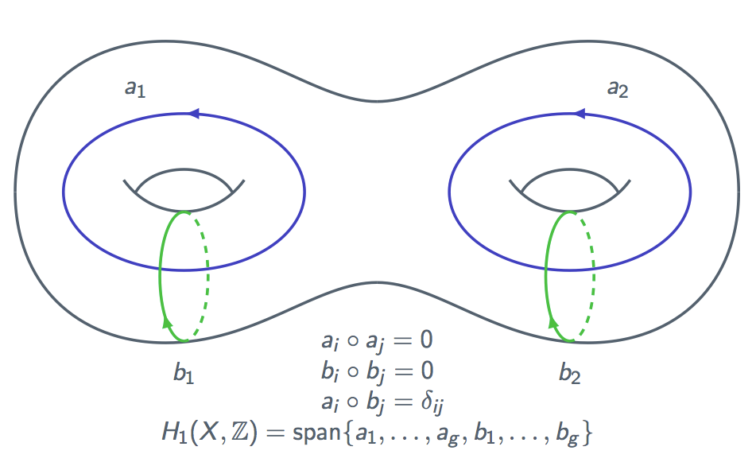
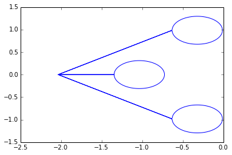
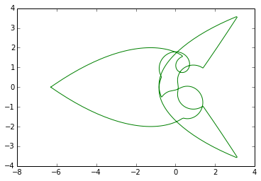

Quick Tutorial
==============

This document presents a brief overview of the capabilities of Abelfunctions by
working through a simple example. For extended examples and particular
applications, please see the :doc:`indepth_tutorials/index` page.

Riemann Surfaces
----------------

One of the primary objects we can construct with abelfunctions is a Riemann
surface. In particular, a Riemann surface :math:`X` obtained by desingularizing
and compactifying a complex plane algebraic curve :math:`f(x,y) = 0`. To create
a Riemann surface, provide a SymPy (http://sympy.org) expression.

.. code-block:: python

  >>> import sympy
  >>> from sympy.abc import x,y
  >>> from abelfunctions import *
  >>> f = y**3 + 2*x**3*y - x**7
  >>> X = RiemannSurface(f,x,y)
  >>> X
  Riemann surface defined by the algebraic curve -x**7 + 2*x**3*y + y**3

Abelfunctions can compute the singularities of the curve and uses the
corresponding information to determine the genus.

.. code-block:: python

  >>> print X.genus()
  2

Holomorphic Differentials
-------------------------

We can compute a basis for the space of holomorphic differentials
:math:`\{\tilde{\omega}_1, \ldots, \tilde{\omega}_g\}` defined on
:math:`X`. The affine part of the differentials are displayed when computed.

.. code-block:: python

  >>> differentials = X.holomorphic_differentials()
  >>> for omega in differentials:
  ...    print omega
  x*y/(2*x**3 + 3*y**2)
  x**3/(2*x**3 + 3*y**2)

Homology Basis
--------------

Dual to the holomorphic differentials is the first homology group of
:math:`X`. This space is spanned by a canonical basis of cycles :math:`\{ a_1,
\ldots, a_g, b_1, \ldots, b_g \}`.

We can compute and plot the projections of these cycles in complex :math:`x`
and :math:`y` planes.

.. code-block:: python

  >>> a_cycles = X.a_cycles()
  >>> b_cycles = X.b_cycles()
  >>> xfig = a_cycles[0].plot_x(512)
  >>> yfig = a_cycles[0].plot_y(512, color='g')
  >>> xfig.show()
  >>> yfig.show()

Period Matrices and Riemann Matrices
------------------------------------

Using the above two ingredients, we can compute the period matrix :math:`\tau =
[A \; \vert \; B] \in \mathbb{C}^{g \times 2g}` and Riemann matrix
:math:`\Omega \in \mathbb{C}^{g \times g}` of :math:`X` where

.. math::
  A_{ij} = \int_{a_j} \tilde{\omega}_i,
  \quad B_{ij} = \int_{b_j} \tilde{\omega}_i,

  \Omega = A^{-1} B.

.. code-block:: python

  >>> import numpy
  >>> numpy.set_printoptions(precision=6) # truncate numerical output
  >>> tau = X.period_matrix()
  >>> tau
  [[ -1.381589e-12-1.201925j   1.849572e+00+0.600962j
     -7.064736e-01+2.174302j  -1.849572e+00+2.545717j]
   [  9.228812e-12+1.971464j   7.161762e-01-0.985732j
     -1.874974e+00-1.362248j  -7.161762e-01+0.2327j  ]]
  >>> Omega = X.riemann_matrix()
  >>> Omega
  [[-1.309017+0.951057j -0.809017+0.587785j]
   [-0.809017+0.587785j -1.000000+1.175571j]]

We numerically verify that :math:`\Omega` is a Riemann matrix: a complex
:math:`g \times g` symmetric matrix with positive definite imaginary part.

.. code-block:: python

  >>> import numpy.linalg
  >>> numpy.linalg.norm(Omega - Omega.T)
  3.64209384448e-11
  >>> numpy.linalg.eigvals(Omega.imag)
  [ 0.464905  1.661722]

Riemann Theta Functions
-----------------------

Another major feature of Abelfunctions is the ability to efficiently compute
the Riemann theta function :math:`\theta : \mathbb{C}^g \times \mathfrak{h}_g`

.. math::

  \theta(z,\Omega) = \sum_{n \in \mathbb{Z}^g} e^{2\pi i \left(
                     \frac{1}{2} n \cdot \Omega n + n \cdot z \right) }

where :math:`\mathfrak{h}_g` is the space of :math:`g \times g` Riemann
matrices. Using the Riemann matrix computed above we can compute
:math:`\theta(z,\Omega)` for various :math:`z \in \mathbb{C}^2`.

.. code-block:: python

  >>> z = [0.5, 0.5*1.0j]
  >>> RiemannTheta(z,Omega)
  (9.12688266829e-12+9.12688266829e-12j)

Abelfunctions is very efficient in computing the Riemann theta function for
many values of :math:`z`. Here we plot the real and imaginary parts of
:math:`\theta(z,\Omega)` for :math:`z = (x + iy, 0)` with :math:`x \in [0,5], y
\in [0,1]`.

First, we setup a grid of complex numbers.

.. code-block:: python

  >>> N = 128
  >>> x = numpy.linspace(-1,1,N)
  >>> y = numpy.linspace(0.1,0.6,N)
  >>> X,Y = numpy.meshgrid(x,y)
  >>> Z = X + 1.0j*Y
  >>> Z = Z.flatten()

Next, we evaluate the Riemann theta function.

.. code-block:: python

  >>> U = RiemannTheta([[z,0] for z in Z], Omega)
  >>> U = U.reshape(N,N)

Finally, we plot the real and imaginary parts of the Riemann theta function at
each of these values.

.. code-block:: python

  >>> import matplotlib
  >>> import matplotlib.pyplot as plt
  >>> fig = plt.figure(figsize=(16,6))
  >>> ax_real = fig.add_subplot(1,2,1, projection='3d')
  >>> ax_real.plot_surface(X, Y, U.real, cmap='jet')
  >>> ax_imag = fig.add_subplot(1,2,2, projection='3d')
  >>> ax_imag.plot_surface(X, Y, U.imag, cmap='jet')
  >>> fig.show()

.. figure:: _static/riemanntheta_genus2.png
  :figwidth: 100%
  :width: 100%
