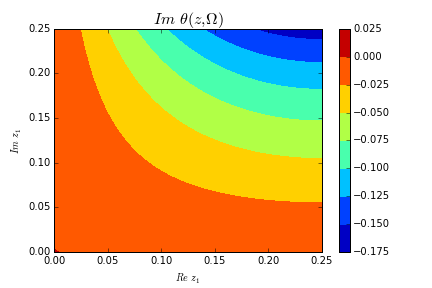

Riemann Theta Functions
=======================

Abelfunctions provides tools for computing with the Riemann theta function. The
implementation is fast and works well with Numpy data types.

The Riemann theta function :math:`\theta : \mathbb{C}^g \times \mathfrak{h}_g`
is defined by

.. math::

  \theta(z,\Omega) = \sum_{n \in \mathbb{Z}^g} e^{2\pi i \left(
                     \frac{1}{2} n \cdot \Omega n + n \cdot z \right) }

where :math:`\mathfrak{h}_g` is the space of :math:`g \times g` Riemann
matrices. It can computed by calling ``RiemannTheta()``, which is located in
:class:`abelfunctions.riemann_theta.riemann_theta.RiemannTheta` of the code.

**Evaluating Theta**

First, we need a :math:`3 \times 3` Riemann matrix: a complex symmetric with
positive definite imaginary part. Throughout this document we will use the
following Riemann matrix as an example:

.. math::

   \Omega = \begin{pmatrix}
   i & 1/2 & 1/2 \\
   1/2 & i & 1/2 \\
   1/2 & 1/2 & i
   \end{pmatrix}

.. code-block:: python

   >>> import numpy
   >>> import matplotlib.pyplot as plt
   >>> from abelfunctions import RiemannTheta
   >>> Omega = [[1.j, 0.5, 0.5],
   ...          [0.5, 1.j, 0.5],
   ...          [0.5, 0.5, 1.j]]

We evaluate the Riemann theta function like so:

.. code-block:: python

   >>> z = [0,0,0]
   >>> RiemannTheta(z, Omega)
   (1.2362529854052204+9.1619877174984454e-35j)

Optionally, we can obtain the "exponential" and "oscillatory" parts of the
Riemann theta function separately. We define

.. math::

   \theta(z, \Omega) = e^{\pi y \cdot Y^{-1} y} \hat{\theta}(z,\Omega)

where :math:`y` and :math:`Y` are the imaginary parts of the vector :math:`z`
and the Riemann matrix :math:`\Omega`, respectively. The function
:math:`\hat{\theta}` is referred to as the *oscillatory part* of :math:`\theta`
and the exponential factor before it is referred to as the *exponential
part*. It is useful to consider these two components separately in order to
control the double-exponential growth of :math:`\theta` in certain
applications.

We compute these separate components using ``RiemannTheta.exponential_part``
and ``RiemannTheta.oscillatory_part``.

.. code-block:: python

   >>> # exponential_part only computes the exponent pi * (y . Yinv*y)
   >>> u = RiemannTheta.exponential_part(z, Omega)
   >>> v = RiemannTheta.oscillatory_part(z, Omega)
   >>> numpy.exp(u)*v
   (1.2362529854052204+9.1619877174984454e-35j)

Derivatives of theta in the unit component directions can be computed by
supplying an optional ``derivs`` keyword. That is, derivatives of the form

.. math::

   \partial_{z_i} \theta\big( (z_1, \ldots, z_g), \Omega \big)

To compute the first :math:`z_1^\text{st}` partial provide the vector
``derivs=[[1,0,...,0]]``.  The ``derivs`` keyword works with the components of
:math:`\theta` as well. Below we compute the three unit directional derivatives
of theta at the point :math:`z = [0.2+0.5i, 0.3-0.1i, -0.1+0.2i]`.

.. code-block:: python

   >>> z = [0.2+0.5j, 0.3-0.1j, -0.1+0.2j]
   >>> RiemannTheta(z, Omega, derivs=[[1,0,0]])
   (-5.72959007264-0.891993752803j)
   >>> RiemannTheta(z, Omega, derivs=[[0,1,0]])
   (-0.163009877076-0.650792690979j)
   >>> RiemannTheta(z, Omega, derivs=[[0,0,1]])
   (1.01154060736+0.0305285337127j)
   >>> u = RiemannTheta.exponential_part(z, Omega, derivs=[[0,0,1]])
   >>> v = RiemannTheta.oscillatory_part(z, Omega, derivs=[[0,0,1]])
   >>> numpy.exp(u)*v
   (1.01154060736+0.0305285337127j)

Second derivatives are computed similarly.

.. code-block:: python

   >>> RiemannTheta(z, Omega, derivs=[[1,0,0],[1,0,0]])
   (-5.5449651294619331+35.991137389193163j)

**Plotting Slices of Theta**

Continuing with this example, we wish to evaluate :math:`\theta(z,\Omega)` on
1-complex dimensional slice of :math:`\mathbb{C}^3` and plot the real an
imaginary parts of the result. In particular, we evaluate :math:`\theta` on

.. math::

   W = \big\{ (z_1, 0, 0) : z_1 \in [0,1/4] \times [0,1/4]i \big\}.

First, we have to generate this set of vectors. We use a numpy `meshgrid
<http://docs.scipy.org/doc/numpy/reference/generated/numpy.meshgrid.html>`_
since we eventually want to display a contour plot.

.. code-block:: python

   >>> n = 64
   >>> x = numpy.linspace(0,0.25,n)
   >>> y = numpy.linspace(0,0.25,n)
   >>> X,Y = numpy.meshgrid(x,y)
   >>> z = (X + 1.j*Y).flatten()
   >>> W = [[z1,0,0] for z1 in z]

To evaluate the Riemann theta function on each of the vectors in ``W`` we
simply pass the list in as an argument ``RiemannTheta(W,Omega)``. One could

.. code-block:: python

   >>> V = RiemannTheta(W, Omega)
   >>> V
   [ 1.23625299 +9.16198772e-35j  1.23623096 +4.61397926e-20j
     1.23616488 +1.85236701e-19j ...,  1.17416789 -1.62839443e-01j
     1.16973862 -1.62986765e-01j  1.16530683 -1.63032759e-01j]

Finally, we plot the real and imaginary parts of the result. Before doing so,
we need to resize the output array to match the dimensions of the ``X``- and
``Y``-coordinate arrays.

.. code-block:: python

   >>> import matplotlib.pyplot as plt
   >>> V.resize((n,n))
   >>> plt.contourf(X,Y,V.real)
   >>> plt.colorbar()
   >>> plt.title(r'$Re\, \theta(z,\Omega)$', size=16)
   >>> plt.xlabel('$Re\, z_1$')
   >>> plt.ylabel('$Im\, z_1$')
   >>> plt.show()

.. figure:: theta_real.png
   :figwidth: 100%
   :align: left

.. code-block:: python

   >>> plt.contourf(X,Y,V.imag)
   >>> plt.colorbar()
   >>> plt.title(r'$Re\, \theta(z,\Omega)$', size=16)
   >>> plt.xlabel('$Re\, z_1$')
   >>> plt.ylabel('$Im\, z_1$')
   >>> plt.show()

